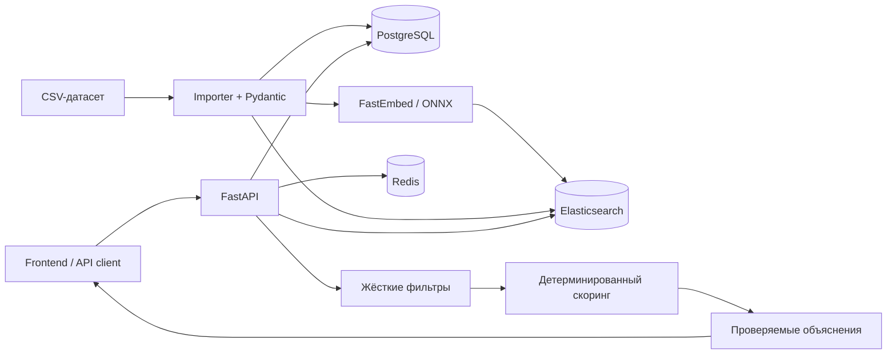

# Smart Contractor Match — backend

Backend сервиса умного подбора event-подрядчиков по задаче **#79-lite**. Сервис принимает параметры мероприятия, исключает заведомо неподходящие профили и возвращает не больше трёх подрядчиков. Для каждого результата API объясняет конкретные причины выбора: доступность в нужную дату, попадание в бюджет, поддержку формата, языка и длительности, а также релевантный факт из описания профиля.

## Что решает продукт

Пользователь уже знает город и тип нужной услуги. Ему не нужен ещё один длинный каталог — ему нужно быстро выбрать из существующего списка.

Сервис решает эту задачу в три этапа:

1. Отсекает подрядчиков, которые заняты, превышают бюджет, не работают с выбранным форматом, языком или длительностью.
2. Ранжирует оставшихся кандидатов по измеримым признакам и смысловой релевантности профиля.
3. Возвращает до трёх карточек с индивидуальным объяснением и статистикой исключений.

Для пользователя явно различаются три результата:

| `status` | Что означает |
| --- | --- |
| `matched` | Найден хотя бы один подходящий подрядчик. В `items` приходит от 1 до 3 карточек. |
| `category_not_found` | В выбранном городе нет ни одного профиля нужной категории. |
| `no_eligible_candidates` | Профили есть, но все исключены условиями запроса. |

Бронирование, заявки и уведомления подрядчику не входят в задачу.

## Данные и ограничения

- Источник: `data/hackathon-dataset-anonymized.csv`.
- В каталоге 66 анонимизированных профилей.
- 13 добавленных профилей помечены `synthetic: true`; этот признак передаётся клиенту.
- Поддерживаемое календарём окно: **23.09.2026–31.12.2026**, всего 100 дней.
- Дата из `busy_dates` является жёстким исключением.
- `max_hours: null` означает, что услуга не привязана к присутствию на площадке. Такой профиль не исключается по длительности.
- Категории площадок проходят тот же пайплайн и проверку календаря, что и специалисты.

## Архитектура



### Роли компонентов

- **FastAPI** — HTTP API, валидация входа, orchestration пайплайна и OpenAPI.
- **PostgreSQL** — источник истины для каталога и значений формы.
- **Elasticsearch** — поиск внутри города и категории, BM25 и cosine similarity по `dense_vector`.
- **FastEmbed / ONNX Runtime** — локальные multilingual embeddings без внешнего AI API.
- **Redis** — кэш полного ответа по каноническому ключу запроса.
- **Docker Compose** — воспроизводимый запуск хранилищ, импортёра и API.

Внешний LLM в текущей версии не используется. Выбор и объяснения полностью воспроизводимы: embeddings влияют на релевантность, а текст объяснения собирается только из подтверждённых полей профиля и запроса.

## Технологии

| Слой | Технология | Назначение |
| --- | --- | --- |
| Runtime | Python 3.12 | Исполнение приложения и импортёра |
| API | FastAPI, Uvicorn | REST API, Swagger UI, OpenAPI |
| Контракты | Pydantic 2, pydantic-settings | Валидация запросов, CSV и конфигурации |
| Основное хранилище | PostgreSQL 16, SQLAlchemy 2, asyncpg | Каталог подрядчиков |
| Поиск | Elasticsearch 8.17 | Фильтрация, BM25, vector similarity |
| AI/ML | FastEmbed 0.8, ONNX Runtime | 384-мерные multilingual embeddings |
| Кэш | Redis 7 | Кэш рекомендаций с TTL |
| Инфраструктура | Docker, Docker Compose | Локальный и демонстрационный запуск |
| Проверки | Pytest, pytest-asyncio, HTTPX | Тесты API, пайплайна и детерминизма |

Embedding-модель: `sentence-transformers/paraphrase-multilingual-MiniLM-L12-v2`. Её веса фиксированы конфигурацией и загружаются во время сборки Docker-образа; во время работы внешний AI API не нужен.

## Как работает подбор

1. **Валидация.** Pydantic проверяет обязательные поля, положительный бюджет, длительность до 24 часов и попадание даты в окно датасета.
2. **Поиск исходного пула.** Elasticsearch выбирает профили только указанного города и категории.
3. **Гибридная релевантность.** Итог поиска объединяет cosine similarity embeddings с весом 70% и BM25 с весом 30%.
4. **Жёсткие фильтры.** Исключаются занятые, слишком дорогие и несовместимые по формату, языку или длительности кандидаты.
5. **Бизнес-скоринг.** Оставшиеся профили получают баллы за запас бюджета, формат, язык, длительность и релевантность описания.
6. **Детерминированная сортировка.** Ключ сортировки — убывание итогового балла, затем стабильный `id`. Один запрос всегда даёт один порядок даже без кэша.
7. **Объяснение.** Для карточки формируются 1–2 предложения из фактов конкретного профиля: дата, цена и запас бюджета, формат, язык, длительность и релевантный фрагмент описания.
8. **Ответ и кэш.** API возвращает до трёх карточек и сохраняет полный ответ в Redis на 300 секунд.

Один профиль может нарушать сразу несколько условий, поэтому суммы счётчиков в `meta.exclusions` могут пересекаться.

## API

После запуска доступны:

| Метод и путь | Назначение |
| --- | --- |
| `POST /api/v1/recommendations` | Получить до трёх рекомендаций |
| `GET /api/v1/catalog/options` | Получить города, категории, форматы и языки для формы |
| `GET /health` | Проверить, что процесс API запущен |
| `GET /ready` | Проверить готовность PostgreSQL, Elasticsearch и Redis |
| `GET /docs` | Swagger UI |
| `GET /openapi.json` | OpenAPI-схема |

### Запрос рекомендации

```json
{
  "city": "Алматы",
  "event_date": "2026-11-14",
  "event_format": "свадьба",
  "category": "Фотограф",
  "budget_kzt": 6000000,
  "duration_hours": 6,
  "language": "русский"
}
```

| Поле | Тип | Обязательное | Правило |
| --- | --- | --- | --- |
| `city` | string | да | Непустое значение из каталога |
| `event_date` | date | да | От `2026-09-23` до `2026-12-31` включительно |
| `event_format` | string | да | Например, `свадьба`, `той`, `корпоратив` |
| `category` | string | да | Например, `Фотограф`, `Ведущий`, `Флорист` |
| `budget_kzt` | integer | да | Больше 0, в тенге |
| `duration_hours` | number | нет | Больше 0 и не больше 24 |
| `language` | string | нет | Например, `русский`, `казахский`, `английский` |

### Ответ

```json
{
  "status": "matched",
  "items": [
    {
      "id": "HK-53108",
      "name": "Альфонс Элрик",
      "categories": ["Фотограф"],
      "city": "Алматы",
      "price_from_kzt": 300000,
      "synthetic": false,
      "explanation": "Свободен 10 октября 2026; стартовая цена 300 000 ₸ укладывается в бюджет с запасом 5 700 000 ₸. Берёт формат «свадьба»; в профиле указано: «...»."
    }
  ],
  "message": "Подобраны 3 из 4 подходящих подрядчиков.",
  "meta": {
    "total_in_city_category": 9,
    "eligible_count": 4,
    "exclusions": {
      "busy": 3,
      "over_budget": 0,
      "wrong_format": 2,
      "wrong_language": 0,
      "insufficient_duration": 0
    }
  }
}
```

Значения в примере иллюстрируют контракт; фактические карточки и счётчики зависят от параметров запроса.

Для всех трёх бизнес-исходов API отвечает `200`. Некорректный запрос получает `422`, недоступное основное хранилище — `503`.

## Быстрый запуск через Docker Compose

### Требования

- Docker Engine или Docker Desktop с Compose v2;
- свободные порты `8000`, `5432`, `6379`, `9200`;
- доступ к интернету при первой сборке для загрузки образов и embedding-модели;
- рекомендуется не менее 4 ГБ свободной оперативной памяти для стека с Elasticsearch.

### 1. Подготовить конфигурацию

Из корня репозитория:

```bash
cd backend
cp .env.example .env
```

На Windows PowerShell вместо `cp` можно выполнить:

```powershell
Copy-Item .env.example .env
```

### 2. Собрать и запустить backend

```bash
docker compose up -d --build
```

При первом запуске сборка может занять несколько минут: Docker скачивает образы и локальную embedding-модель.

Compose запускает сервисы в правильном порядке:

1. PostgreSQL, Redis и Elasticsearch проходят healthcheck.
2. Одноразовый контейнер `importer` валидирует CSV, создаёт таблицу, строит embeddings, синхронизирует PostgreSQL и пересоздаёт Elasticsearch-индекс.
3. API стартует только после успешного завершения импортёра.

### 3. Проверить контейнеры и готовность

```bash
docker compose ps -a
docker compose logs importer api
curl -sS http://localhost:8000/health
curl -sS http://localhost:8000/ready
```

Ожидается:

- `postgres`, `redis`, `elasticsearch` и `api` имеют состояние `healthy`;
- `importer` завершился с кодом `0`;
- `/health` возвращает HTTP 200;
- `/ready` возвращает HTTP 200 и готовность каталога и кэша.

Swagger UI: <http://localhost:8000/docs>.

### 4. Остановить backend

```bash
docker compose down
```

Данные PostgreSQL и Elasticsearch сохраняются в Docker volumes. Чтобы полностью удалить их и повторить импорт с нуля:

```bash
docker compose down -v
```

### Полезные команды

Повторно импортировать изменённый CSV:

```bash
docker compose run --rm importer
```

Следить за логами API:

```bash
docker compose logs -f api
```

Если стандартные порты заняты, измените `API_PORT`, `POSTGRES_PORT`, `REDIS_PORT` и `ELASTICSEARCH_PORT` в `.env`, затем повторите запуск.

## Как проверить решение

Ниже — воспроизводимый сценарий проверки Definition of Done. Все команды выполняются после успешного запуска Compose.

### Шаг 1. Проверить каталог формы

```bash
curl -sS http://localhost:8000/api/v1/catalog/options | python -m json.tool
```

Ответ должен содержать непустые массивы `cities`, `categories`, `event_formats` и `languages`.

### Шаг 2. Плотная категория

```bash
curl -sS -X POST http://localhost:8000/api/v1/recommendations \
  -H 'Content-Type: application/json' \
  -d '{
    "city": "Алматы",
    "event_date": "2026-10-10",
    "event_format": "свадьба",
    "category": "Фотограф",
    "budget_kzt": 6000000
  }' | python -m json.tool
```

Проверить:

- `status` равен `matched`;
- в `items` не больше трёх карточек;
- объяснения различаются и содержат конкретную цену, дату и факт профиля;
- `meta` показывает размер пула и причины исключений.

### Шаг 3. Редкая категория и результат меньше трёх

```bash
curl -sS -X POST http://localhost:8000/api/v1/recommendations \
  -H 'Content-Type: application/json' \
  -d '{
    "city": "Алматы",
    "event_date": "2026-10-10",
    "event_format": "свадьба",
    "category": "Флорист",
    "budget_kzt": 6000000
  }' | python -m json.tool
```

Ожидается `matched`, одна карточка и текстовое объяснение, почему результатов меньше трёх.

### Шаг 4. Кандидаты есть, но никто не проходит условия

```bash
curl -sS -X POST http://localhost:8000/api/v1/recommendations \
  -H 'Content-Type: application/json' \
  -d '{
    "city": "Алматы",
    "event_date": "2026-10-10",
    "event_format": "свадьба",
    "category": "Фотограф",
    "budget_kzt": 1
  }' | python -m json.tool
```

Ожидается `no_eligible_candidates`, пустой `items` и явная причина `превышают бюджет` в `message` и `meta.exclusions`.

### Шаг 5. В городе нет выбранной категории

```bash
curl -sS -X POST http://localhost:8000/api/v1/recommendations \
  -H 'Content-Type: application/json' \
  -d '{
    "city": "Зарубежье",
    "event_date": "2026-10-10",
    "event_format": "свадьба",
    "category": "Флорист",
    "budget_kzt": 6000000
  }' | python -m json.tool
```

Ожидается `category_not_found`, пустой `items` и понятное сообщение об отсутствии категории в городе.

### Шаг 6. Проверить детерминизм и влияние даты

Скрипт использует только стандартную библиотеку Python:

```bash
python - <<'PY'
import json
from urllib.request import Request, urlopen

URL = "http://localhost:8000/api/v1/recommendations"
BASE = {
    "city": "Алматы",
    "event_format": "свадьба",
    "category": "Фотограф",
    "budget_kzt": 6000000,
}

def recommend(event_date):
    body = json.dumps({**BASE, "event_date": event_date}).encode()
    request = Request(URL, data=body, headers={"Content-Type": "application/json"})
    with urlopen(request, timeout=10) as response:
        return json.load(response)

first = recommend("2026-10-10")
repeat = recommend("2026-10-10")
other_date = recommend("2026-11-14")

first_ids = [item["id"] for item in first["items"]]
repeat_ids = [item["id"] for item in repeat["items"]]
other_ids = [item["id"] for item in other_date["items"]]

assert first_ids == repeat_ids, (first_ids, repeat_ids)
assert first_ids != other_ids, (first_ids, other_ids)
assert all("Свободен" in item["explanation"] for item in first["items"])
assert all("Свободен" in item["explanation"] for item in other_date["items"])

print("Детерминизм: OK", first_ids)
print("Другая дата меняет выдачу: OK", other_ids)
PY
```

### Шаг 7. Проверить время ответа

```bash
curl -sS -o /dev/null \
  -w 'HTTP %{http_code}; time %{time_total}s\n' \
  -X POST http://localhost:8000/api/v1/recommendations \
  -H 'Content-Type: application/json' \
  -d '{
    "city": "Алматы",
    "event_date": "2026-10-10",
    "event_format": "свадьба",
    "category": "Фотограф",
    "budget_kzt": 6000000
  }'
```

Ориентир ТЗ — ответ быстрее 10 секунд. Повторный идентичный запрос обычно обслуживается из Redis.

## Автоматические тесты

Для тестов необязательно запускать Docker-сервисы: репозитории и внешние зависимости подменяются контролируемыми тестовыми реализациями.

Linux/macOS/WSL:

```bash
cd backend
python3.12 -m venv .venv
source .venv/bin/activate
python -m pip install --upgrade pip
pip install -r requirements-dev.txt
pytest
```

Windows PowerShell:

```powershell
cd backend
py -3.12 -m venv .venv
.\.venv\Scripts\Activate.ps1
python -m pip install --upgrade pip
pip install -r requirements-dev.txt
pytest
```

Набор тестов проверяет:

- API-контракт и три бизнес-статуса;
- исключение занятых подрядчиков;
- бюджет, формат, язык и длительность;
- поведение `max_hours: null`;
- детерминированный порядок;
- смену результата при другой дате;
- объяснения и сообщения при выдаче меньше трёх карточек;
- загрузку и валидацию датасета;
- embeddings и построение поискового индекса;
- явную маркировку синтетических профилей.

## Конфигурация

Основные переменные находятся в `.env.example`:

| Переменная | Значение по умолчанию | Назначение |
| --- | --- | --- |
| `API_PORT` | `8000` | Внешний порт API в Compose |
| `FRONTEND_ORIGIN` | `http://localhost:5173` | Разрешённый CORS origin; можно перечислить несколько через запятую |
| `DATABASE_URL` | PostgreSQL в Compose | Строка подключения SQLAlchemy |
| `REDIS_URL` | Redis в Compose | Адрес кэша |
| `CACHE_TTL_SECONDS` | `300` | TTL ответа рекомендации |
| `CACHE_REQUEST_TIMEOUT` | `0.25` | Таймаут операции Redis, секунды |
| `ELASTICSEARCH_URL` | Elasticsearch в Compose | Адрес поискового сервиса |
| `ELASTICSEARCH_INDEX` | `contractors-v1` | Имя индекса |
| `ELASTICSEARCH_REQUEST_TIMEOUT` | `4` | Таймаут поискового запроса, секунды |
| `MAX_CANDIDATES` | `500` | Максимальный пул до бизнес-фильтров |
| `EMBEDDING_MODEL` | `paraphrase-multilingual-MiniLM-L12-v2` | Модель embeddings |
| `EMBEDDING_DIMENSIONS` | `384` | Размер вектора Elasticsearch |
| `SEMANTIC_SEARCH_WEIGHT` | `0.7` | Вес cosine similarity |
| `LEXICAL_SEARCH_WEIGHT` | `0.3` | Вес BM25 |

## Структура backend

```text
backend/
├── app/
│   ├── api/             # FastAPI-маршруты и зависимости
│   ├── core/            # конфигурация, нормализация текста, логирование
│   ├── database/        # SQLAlchemy-модели и подключение PostgreSQL
│   ├── models/          # внутренние модели
│   ├── repositories/    # PostgreSQL и Elasticsearch
│   ├── schemas/         # Pydantic-контракты API и датасета
│   └── services/        # embeddings, фильтрация, скоринг, объяснения, кэш
├── data/                # CSV-датасет
├── scripts/             # импорт и синхронизация хранилищ
├── tests/               # автоматические тесты
├── Dockerfile
├── docker-compose.yml
├── requirements.txt
└── requirements-dev.txt
```

## Надёжность и деградация

- Импортёр останавливается с ошибкой при невалидной строке, пустом датасете или дублирующемся `id`.
- API не запускается до успешного импорта каталога.
- Если Redis временно недоступен, запрос рекомендации продолжает работать без кэша; `/ready` при этом показывает деградацию.
- Elasticsearch-индекс пересоздаётся импортёром, поэтому PostgreSQL и поиск синхронизируются одной операцией.
- Ключ кэша строится из нормализованного запроса, поэтому одинаковые параметры используют один ответ.

## Чек-лист перед демонстрацией

- [ ] `docker compose ps -a` показывает healthy-сервисы и успешно завершённый `importer`.
- [ ] `/ready` отвечает HTTP 200.
- [ ] Плотная категория возвращает не больше трёх различимых объяснений.
- [ ] Редкая категория возвращает доступное число карточек и объясняет, почему их меньше трёх.
- [ ] Запрос с бюджетом `1` возвращает `no_eligible_candidates`, а не пустой экран или ошибку.
- [ ] Несуществующая для города категория возвращает `category_not_found`.
- [ ] Повтор запроса сохраняет порядок карточек.
- [ ] Смена даты меняет выдачу и дату в объяснениях.
- [ ] Синтетическая запись отображается с `synthetic: true`.
- [ ] `pytest` завершается без ошибок.
